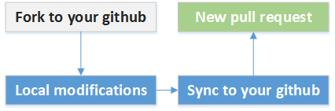

# iCode-Android
[](https://badge.fury.io/gh/RayFantasyStudio%2FiCode-Android)  
## 引入
### 在 IntelliJ IDEA 或 Android Studio 中
1. clone项目到本地。
2. **(非常重要)**在项目根目录创建`bugly.properties`，写入以下内容（bugly官方网址<http://bugly.qq.com/>）
```
appId=$$申请的bugly的appId$$
appKey=$$申请的bugly的appKey$$
```
在IDE中使用File->Open打开即可
## 贡献代码
    iCode开源项目致力于为开发者提供更好的交流平台，其开源项目旨为更加好地建设iCode。
//若有好的想法想加入iCode官方APP、对iCode有建议的话，请继续往下读。
```
地址： https://github.com/RayFantasyStudio/iCode-Android
官网： http://rayfantasy.com:8088/
```
- 关于如何同我们开发，详情请搜索git相关教程。
我们鼓励开发者为开源社区作出贡献，利用Github的Pull-Request机制，或VCS版
本控制工具git，便可将内容变更发送给iCode官方审阅。

- 具体流程图


### 具体步骤
1. 首先，在github页面上，点击“Fork”，将iCode的git库拷贝到自己账户
2. 然后，对拷贝的git库进行修改，将内容变更提交到自己的账户
3. 最后，在github页面上，点击"New pull request"，向iCode官方发起代码审阅
4. 希望和大家共建和谐美好开源环境！

更多信息交流讨论：
- QQ  : 49162418

## 项目预览


## 许可证
``` 
Copyright 2015-2016 Alex Zhang aka. ztc1997
Copyright 2015-2016 AllenTom
Copyright 2015-2016 LollipopKit

 Licensed under the Apache License, Version 2.0 (the "License");
 you may not use this file except in compliance with the License.
 You may obtain a copy of the License at
 
     http://www.apache.org/licenses/LICENSE-2.0
 
 Unless required by applicable law or agreed to in writing, software
 distributed under the License is distributed on an "AS IS" BASIS,
 WITHOUT WARRANTIES OR CONDITIONS OF ANY KIND, either express or implied.
 See the License for the specific language governing permissions and
 limitations under the License.
```
